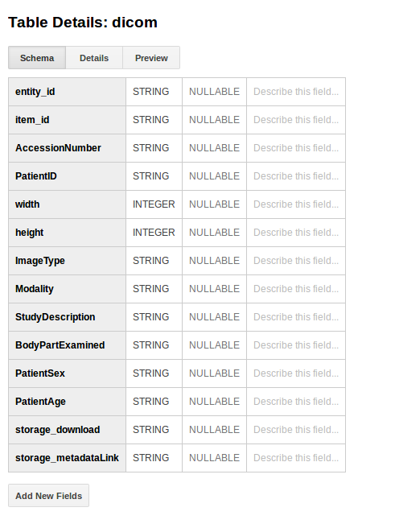

# Storage
When we get here, we have anonynized our data, and the user can optionally choose to send it off to cloud storage. As a reminder, this is determined in the settings, under [settings/config.py](../sendit/settings/config.py):

```
# Should we send to Google at all?
SEND_TO_GOOGLE=False

# Google Cloud Storage
GOOGLE_CLOUD_STORAGE='som-pacs'
```

Importantly, for the above, there must be `GOOGLE_APPLICATION_CREDENTIALS` filepath, a `GOOGLE_PROJECT_NAME`, and a `GOOGLE_STORAGE_COLLECTION` variables exported in the environment, or it should be run on a Google Cloud Instance (unlikely).

## Upload Process
By the time we get here, we've anonymized the images, and prepared an equivalent corresponding lookup (with old image identifier) that also has the same anonymized metadata. The difference is that the lookup has additional information from nested sequences that are easy to extract. We now proceed to use the som tools google storage API client to upload a set of images associated with an entity and metadata to Google Storage (images) and Google BigQuery (metadata).

Speifically, we retrieve images for the batch that weren't flagged for having possible PHI in the pixels, meaning they are in the entity's PHI folder. We instantiate a client based on the storage bucket and project name (the `GOOGLE_APPLICATION_CREDENTIALS` are essential for this to work. If you get permissions errors, you have an issue either with finding this file, or the file (the IAM permissions) in Google Cloud not having Read/Write/Admin access to the resource) and the client sends images to Google Storage, and metadata to BigQuery.

## Storage
The images are first uploaded to Storage, and complete metadata about their location , etc, returned. In object storage, a "path" is really a key for the object. We use an organizational schema that groups things on the level of Collection (IRB), Entity (Patient) and Image Set (Study). For example, for google bucket "radiology" we might see:

```
Buckets/radiology/Collection/IRB41449/Entity/GL664ba0/GL664ba0_20070904_GL71cfb7.tar.gz
Buckets/<bucket>/Collection/<irb-num>/Entity/<patient>/<images>
```

In the above, the final compressed object is all images for a single study, and this may change to include another level of study identifier, and single dicoms.

When the upload to Storage is done, we receive back metadata about its location. This additional metadata, along with the item metadata in `items` is then uploaded to BigQuery. This means that we have a nice strategy for searching very detailed fields (BigQuery) to get direct links to items (Storage). The dicom schema used by the som-tools looks like this:




## Metadata
We then create a collection, and in BigQuery, this corresponds to a Dataset, and we name it based on `GOOGLE_CLOUD_COLLECTION`, which should be an IRB number. Given that it already exists, it is just retrieved. We then create a table in the collection called "dicom" to indicate dicom images (or possibly compressed dicom?). The general idea behind a metadata database is to provide very rough, high level searchable fields that a researcher would be interested in, such as the age and gender, and the upload agent. We could add additional metadata here.


### Query in Console
If you are using the Google Cloud Console, here are some helpful queries:

```
SELECT * FROM IRB41449:Collection.__TABLES_SUMMARY__;
```
